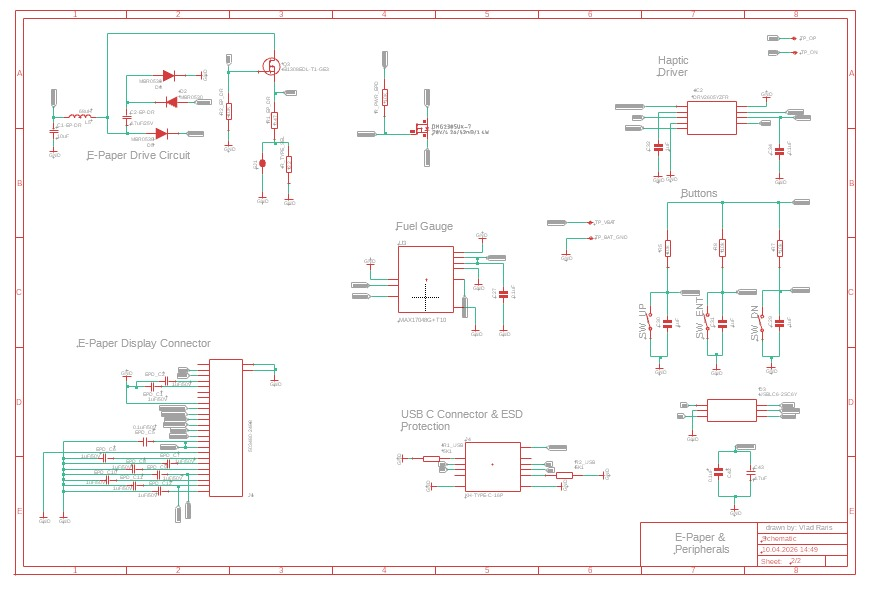
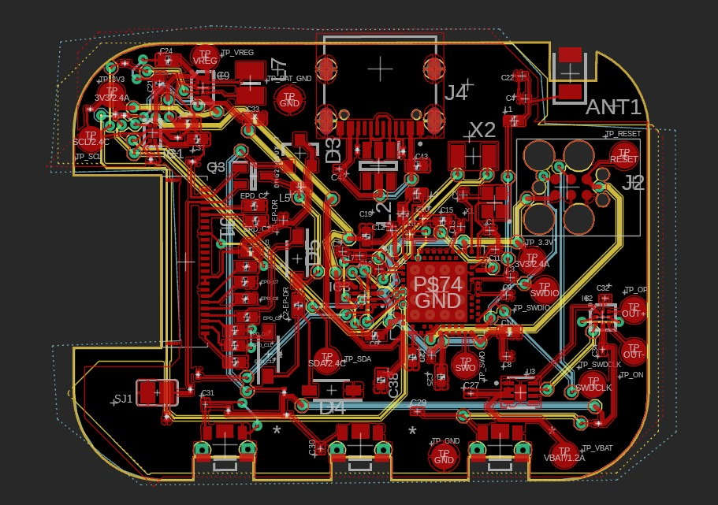
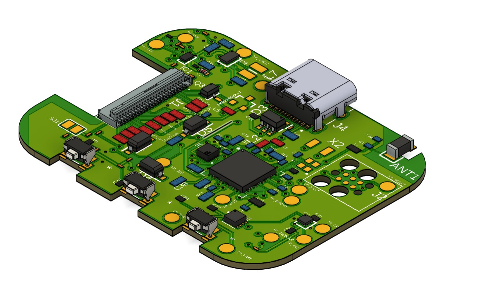
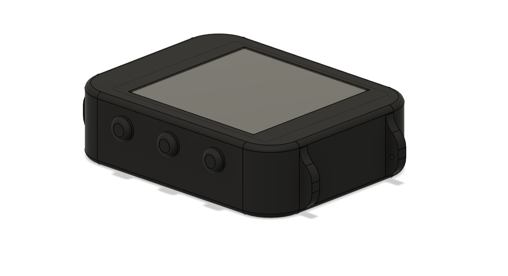

# InkTime Smartwatch

Un smartwatch open-source cu ecran E-Paper, construit în jurul SoC-ului Nordic nRF52840. Proiectul acoperă etapa de Engineering Validation (EVT): design-ul hardware complet (schematic + PCB), fișierele de fabricație și modelul 3D al ansamblului.

## Cuprins

- [Diagrama Bloc](#diagrama-bloc)
- [Descriere Hardware](#descriere-hardware)
- [Pinout nRF52840](#pinout-nrf52840)
- [Bill of Materials](#bill-of-materials)
- [Estimare Consum Energetic](#estimare-consum-energetic)
- [Decizii de Design și Constrângeri](#decizii-de-design-și-constrângeri)
- [Imagini](#imagini)
- [Structura Repository-ului](#structura-repository-ului)
- [Licență](#licență)

---

## Diagrama Bloc
 
```
                          ┌─────────────────────────────────┐
                          │         nRF52840 (U1)           │
                          │       SoC + BLE Radio           │
                          │                                 │
          ┌───────────────┤ P0.06 (SDA)     P0.02 (SCK)    ├──── SPI ────┐
          │  I2C Bus      │ P0.07 (SCL)     P0.03 (MOSI)   │             │
          │               │                 P0.05 (CS)      │             │
          │               │                 P0.15 (DC)      │             │
          │               │                 P0.16 (RST)     │             │
          │               │                 P0.17 (BUSY)    │             │
          │               │                                 │             │
          │               │ P0.13 ──── SW_UP (buton)        │    ┌────────┴────────┐
          │               │ P0.14 ──── SW_ENTER (buton)     │    │  E-Paper 1.54"  │
          │               │ P1.02 ──── SW_DOWN (buton)      │    │  (via FPC J1)   │
          │               │                                 │    └─────────────────┘
          │               │ P0.12 ──── HAPTIC_EN (DRV2605)  │
          │               │ P0.08 ──── IMU_INT1             │
          │               │ P1.08 ──── IMU_INT2             │
          │               │ P0.10 ──── ALERT (fuel gauge)   │
          │               │ P0.11 ──── PMIC_INT (charger)   │
          │               │ P1.01 ──── EPD_PWR (MOSFET)     │
          │               │                                 │
          │               │ D+/D- ──── USB-C (J4)           │
          │               │ SWDIO/SWDCLK ── Debug (J2)      │
          │               │                                 │
          │               │ ANT (H23) ── Antenă 2.4GHz      │
          │               └─────────────────────────────────┘
          │
     ┌────┴─────────────────────────────────────────────────┐
     │                   Magistrala I2C                      │
     │   (SDA = P0.06, SCL = P0.07, pull-up 3.3kΩ)         │
     ├──────────────┬──────────────┬─────────────┬──────────┤
     │              │              │             │          │
┌────┴────┐  ┌─────┴─────┐  ┌────┴────┐  ┌────┴────┐     │
│ BMA423  │  │ DRV2605   │  │MAX17048 │  │BQ25180  │     │
│  (IC3)  │  │  (IC2)    │  │  (U3)   │  │ (IC1)   │     │
│  IMU    │  │ Haptic    │  │  Fuel   │  │ Charger │     │
│         │  │ Driver    │  │  Gauge  │  │         │     │
└─────────┘  └───────────┘  └────┬────┘  └────┬────┘     │
                                 │             │          │
                            ┌────┴─────────────┴────┐     │
                   ┌───────>│  Baterie LiPo 250mAh  │     │
                   │        │    AKYGA LP502030      │     │
                   │        └───────────┬────────────┘     │
                   │                    │ VREG (SYS)       │
              USB-C (J4)         ┌──────┴──────┐           │
              VBUS ─────────────>│  RT6160     │           │
                                 │  (IC9)      │           │
                                 │  Buck-Boost │           │
                                 └──────┬──────┘           │
                                        │                  │
                                    3.3V Rail ─────────────┘
```

---

## Descriere Hardware

Inima proiectului este **nRF52840** — un SoC cu procesor ARM Cortex-M4F la 64 MHz, 1 MB Flash și 256 KB RAM, plus radio BLE 5.0 integrat. Pe lângă logica principală, el controlează direct toate perifericele de pe placă.

**Managementul energiei** funcționează într-un lanț: USB-C → BQ25180 (charger LiPo) → baterie AKYGA LP502030 (250 mAh, 3.7V) → RT6160 (buck-boost) → 3.3V stabil pentru tot sistemul. Tensiunea bateriei este monitorizată de un fuel gauge MAX17048, care trimite alerte prin I2C și pin-ul ALERT când bateria scade sub praguri configurabile. Charger-ul BQ25180 comunică și el pe I2C, permițând configurarea curentului de încărcare, iar pin-ul !INT semnalează evenimente (încărcare completă, erori termice, etc.).

**Afișajul** este un ecran E-Paper de 1.54" conectat printr-un flex cable (FPC de 24 pini, conector Molex 503480-2400). E-Paper-ul consumă curent doar la refresh și își menține imaginea fără alimentare. Alimentarea display-ului este controlată separat prin P1.01, care comandă un MOSFET P-channel (DMG2305UX-7) — astfel display-ul poate fi oprit complet pentru a economisi energie. Comunicația cu display-ul se face pe SPI, cu pini adiționali de control (DC, RST, BUSY).

**Senzorul de mișcare** BMA421/BMA423 (accelerometru triaxial, 12 biți) este pe magistrala I2C și oferă două ieșiri de întrerupere (INT1 pe P0.08 și INT2 pe P1.08). Este folosit pentru numărarea pașilor, detecția gesturilor (raise-to-wake) și orientarea ecranului. Pin-ul SDO al senzorului este legat la GND prin R3, ceea ce setează adresa I2C la 0x18.

**Feedback haptic**: un motor de vibrații controlat de DRV2605 (driver dedicat cu bibliotecă internă de efecte). Driverul primește comenzi pe I2C și este activat/dezactivat de P0.12 (EN). Ieșirile OUT+ și OUT- merg la motorul haptic (shaker), cu test pad-uri pe placă pentru debugging.

**Butoanele**: trei butoane push (UP, ENTER, DOWN) cu rezistențe de pull-up de 10kΩ la 3.3V și condensatoare de debouncing de 1µF pe fiecare. Sunt active pe LOW — apăsarea trage pinul la GND.

**Conectivitate BLE**: antena ceramică Johanson 2450AT18B100E, conectată la pinul ANT al nRF52840 printr-o rețea de impedanță matching (L1 = 3.9nH, C3 = 1pF, C4 = 1pF). Zona de sub antenă este decupată din toate cele trei planuri de masă.

**Debug/Programare**: interfață SWD (SWDIO, SWDCLK) rutată la conectorul Tag-Connect TC2030-IDC (J2) și la test pad-uri. Pin-ul SWO (P1.00) este disponibil și el pe test pad pentru trace output.

---

## Pinout nRF52840

Tabelul de mai jos detaliază fiecare pin utilizat al microcontroller-ului, cu referința la ball-ul din pachetul aQFN (7x7 mm, 73 pini).

| Pin nRF52840 | Ball | Net / Semnal | Destinație | Notă |
|:---|:---|:---|:---|:---|
| P0.00/XL1 | D2 | P0.00/XL1 | Crystal 32.768 kHz (X2) | Low-frequency clock |
| P0.01/XL2 | F2 | P0.01/XL2 | Crystal 32.768 kHz (X2) | Low-frequency clock |
| P0.02/AIN0 | A12 | SCK | E-Paper SPI Clock | SPI master |
| P0.03/AIN1 | B13 | MOSI | E-Paper SPI Data | SPI master |
| P0.05/AIN3 | K2 | EPD_CS | E-Paper Chip Select | SPI CS, active LOW |
| P0.06 | L1 | SDA | Magistrala I2C - Data | BQ25180, BMA423, DRV2605, MAX17048 |
| P0.07 | M2 | SCL | Magistrala I2C - Clock | Pull-up 3.3kΩ la 3V3 |
| P0.08 | N1 | IMU_INT1 | BMA423 Interrupt 1 | Step counter, gesture detection |
| P0.10/NFC2 | J24 | ALERT | MAX17048 Battery Alert | Active LOW |
| P0.11 | T2 | PMIC_INT | BQ25180 !INT | Semnalizare stare încărcare |
| P0.12 | U1 | HAPTIC_EN | DRV2605 Enable | Activare driver haptic |
| P0.13 | AD8 | SW_UP | Buton UP | Pull-up 10kΩ (R5), debounce 1µF (C30) |
| P0.14 | AC9 | SW_ENTER | Buton ENTER | Pull-up 10kΩ (R8), debounce 1µF (C31) |
| P0.15 | AD10 | EPD_DC | E-Paper Data/Command | HIGH = date, LOW = comandă |
| P0.16 | AC11 | EPD_RST | E-Paper Reset | Active LOW |
| P0.17 | AD12 | EPD_BUSY | E-Paper Busy | HIGH = display ocupat |
| P0.18/RESET | AC13 | RESET | System Reset | Rutat la TP_RESET și J2 |
| P1.00 | AD22 | SWO | Serial Wire Output | Debug trace, rutat la TP_SWO |
| P1.01 | Y23 | EPD_PWR | MOSFET gate (DMG2305UX) | Controlează alimentarea display-ului |
| P1.02 | W24 | SW_DOWN | Buton DOWN | Pull-up 10kΩ (R7), debounce 1µF (C29) |
| P1.08 | P2 | IMU_INT2 | BMA423 Interrupt 2 | Al doilea canal de întrerupere |
| D+ | AD6 | D+ | USB-C Data+ | Prin ESD protection (USBLC6-2SC6Y) |
| D- | AD4 | D- | USB-C Data- | Prin ESD protection (USBLC6-2SC6Y) |
| VBUS | AD2 | VBUS | USB VBUS sense | Detectare conexiune USB |
| SWDIO | AC24 | SWDIO | SWD Debug Data | Rutat la J2 (TC2030) și TP |
| SWDCLK | AA24 | SWDCLK | SWD Debug Clock | Rutat la J2 (TC2030) și TP |
| XC1 | B24 | - | Crystal 32 MHz (X1) | High-frequency clock |
| XC2 | A23 | - | Crystal 32 MHz (X1) | High-frequency clock |
| ANT | H23 | ANT | Rețea matching + Antenă | 2.4 GHz BLE |
| VDDH | Y2 | 3V3 | Alimentare high voltage | 3.3V |
| VDD (multiple) | W1, AD14, B1, A22, AD23 | 3V3 | Alimentare digitală | Fiecare cu condensator de decuplare |
| DCC | B3 | - | DC/DC inductor intern | L2 (10µH) |
| DEC1-6 | diverse | - | Decoupling intern nRF | Condensatoare conform datasheet-ului |

**Pini liberi** (neconectați, disponibili pentru extensii viitoare): P0.04, P0.09, P0.19–P0.31, P1.03–P1.07, P1.09–P1.15.

---

## Bill of Materials

### Componente principale

| Componentă | MFR Part Number | Descriere | JLCPCB Part # | Datasheet |
|:---|:---|:---|:---|:---|
| nRF52840 (U1) | NRF52840-QFAA | SoC BLE 5.0, ARM Cortex-M4F, aQFN-73 | [C190794](https://jlcpcb.com/partdetail/NordicSemicon-NRF52840_QIAAR/C190794) | [Nordic](https://infocenter.nordicsemi.com/pdf/nRF52840_PS_v1.8.pdf) |
| BQ25180 (IC1) | BQ25180YBGR | Charger LiPo, I2C configurabil, BGA-8 | [C3682423](https://jlcpcb.com/partdetail/TexasInstruments-BQ25180YBGR/C3682423) | [TI](https://www.ti.com/lit/ds/symlink/bq25180.pdf) |
| DRV2605 (IC2) | DRV2605YZFR | Haptic driver ERM/LRA, I2C, BGA-9 | [C81079](https://jlcpcb.com/partdetail/TexasInstruments-DRV2605YZFR/C81079) | [TI](https://www.ti.com/lit/ds/symlink/drv2605.pdf) |
| BMA423 (IC3) | BMA423 | Accelerometru triaxial, 12-bit, I2C, LGA-12 | [C437656](https://jlcpcb.com/parts) | [Bosch](https://www.bosch-sensortec.com/media/boschsensortec/downloads/datasheets/bst-bma423-ds000.pdf) |
| RT6160 (IC9) | RT6160AWSC | Buck-Boost DC/DC, I2C, WL-CSP-15 | [C20621404](https://jlcpcb.com/parts) | [Richtek](https://www.richtek.com/assets/product_file/RT6160A/DS6160A-05.pdf) |
| MAX17048 (U3) | MAX17048G+T10 | Fuel gauge LiPo, I2C, TDFN-8 | [C2682616](https://jlcpcb.com/partdetail/MaximIntegrated-MAX17048GT10/C2682616) | [Analog Devices](https://datasheets.maximintegrated.com/en/ds/MAX17048-MAX17049.pdf) |
| Antenă BLE (ANT1) | 2450AT18B100E | Antenă ceramică 2.4 GHz, 1206 | - | [Johanson](https://www.johansontechnology.com/datasheets/2450AT18B100/2450AT18B100.pdf) |
| FPC Connector (J1) | 503480-2400 | Molex 24-pin FPC, 0.5mm pitch | - | [Molex](https://www.molex.com/en-us/products/part-detail/5034802400) |
| USB-C (J4) | KH-TYPE-C-16P | Connector USB-C 16 pini, Kinghelm | - | [Kinghelm](https://www.snapeda.com/parts/KH-TYPE-C-16P/Kinghelm/view-part/) |
| Tag-Connect (J2) | TC2030-IDC | Conector debug SWD, 6 pini | - | [Tag-Connect](https://www.tag-connect.com/product/tc2030-idc) |
| ESD Protection (D3) | USBLC6-2SC6Y | TVS diode array, USB ESD, SOT-23-6 | - | [ST](https://www.st.com/resource/en/datasheet/usblc6-2.pdf) |
| MOSFET P-ch | DMG2305UX-7 | P-MOSFET, 20V/4.2A, SOT-23 | - | [Diodes Inc.](https://www.diodes.com/assets/Datasheets/DMG2305UX.pdf) |
| MOSFET N-ch (Q3) | SI1308EDL-T1-GE3 | N-MOSFET, 30V/1.5A, SC-70 | - | [Vishay](https://www.vishay.com/docs/63399/si1308edl.pdf) |
| Schottky Diodes (D2,D4,D5) | MBR0530 | 30V/0.5A, SOD-123 | - | [ON Semi](https://www.onsemi.com/pdf/datasheet/mbr0520-d.pdf) |
| Butoane (x3) | EVP-AKE31A | Push button, Panasonic | - | [Panasonic](https://industrial.panasonic.com/cdbs/www-data/pdf/ATV0000/ATV0000CE3.pdf) |
| Crystal 32 MHz (X1) | - | XTAL 2016 package | - | - |
| Crystal 32.768 kHz (X2) | - | XTAL 3215 package | - | - |
| Inductor (L7) | FTC252012SR47MBCA | 0.47µH, 2520, TDK | [C5832368](https://jlcpcb.com/partdetail/6763488-FTC252012SR47MBCA/C5832368) | [TDK](https://product.tdk.com/en/search/inductor/inductor/smd/info?part_no=FTC252012SR47MBCA) |

### Pasive (sumarizat)

| Tip | Valori | Capsulă | Cantitate |
|:---|:---|:---|:---|
| Rezistențe 0201 | 0.47Ω, 2.2Ω, 3.3kΩ, 5.1kΩ, 7.68kΩ, 10kΩ | 0201 (0.6x0.3mm) | ~20 buc |
| Condensatoare ≤100nF | 1pF, 12pF, 47nF, 100pF, 100nF | 0201 | ~15 buc |
| Condensatoare >100nF | 1µF, 4.7µF, 10µF, 22µF | 0402 | ~25 buc |
| Inductori | 3.9nH, 10µH, 15µH, 68µH | 0402 | 4 buc |

Lista completă se regăsește în [`Manufacturing/BOM.csv`](Manufacturing/BOM.csv), iar coordonatele de asamblare în [`Manufacturing/PickAndPlace.csv`](Manufacturing/PickAndPlace.csv).

---

## Estimare Consum Energetic

Valorile sunt extrase din datasheet-urile componentelor, pentru modul activ și sleep.

| Componentă | Mod Activ | Mod Sleep / Idle | Notă |
|:---|:---|:---|:---|
| nRF52840 (CPU @ 64MHz) | ~5 mA | ~1.5 µA (System OFF) | CPU + Radio off în sleep |
| nRF52840 (BLE TX) | ~5–8 mA (0 dBm) | - | Transmisie BLE la 0 dBm |
| E-Paper 1.54" | ~15–25 mA (refresh) | ~0 µA | Consum doar la refresh, ~2-3s/refresh |
| BMA423 | ~150 µA | ~14 µA (low-power) | Accelerometru în modul low-power |
| MAX17048 | ~23 µA | ~3 µA (hibernate) | Fuel gauge, citiri periodice |
| BQ25180 | ~1 mA (charging) | ~1 µA (standby) | Consum propriu, fără curentul de încărcare |
| DRV2605 | ~10 mA (activ, cu motor) | ~650 µA (standby) | Standby cu EN LOW |
| RT6160 | ~30 µA (quiescent) | ~30 µA | Eficiența >90% la sarcini mici |

**Estimare viață baterie (250 mAh)**:
- *Standby pur* (ecran static, BLE off, CPU sleep): ~1.5µA + 14µA + 3µA + 1µA + 30µA ≈ **50 µA** → ~5000 ore (~208 zile)
- *Utilizare normală* (10 refresh-uri display/oră, BLE advertising, step counting): consum mediu estimat la **~0.3–0.5 mA** → ~500–830 ore (~21–35 zile)
- *Utilizare intensă* (BLE conectat, refresh-uri frecvente, haptic): consum mediu ~2–5 mA → ~2–5 zile

Aceste estimări sunt teoretice; consumul real va depinde de firmware și pattern-urile de utilizare.

---

## Decizii de Design și Constrângeri

### Reguli PCB respectate
- **Dimensiune PCB**: ~46 x 35 mm (forme octogonale cu decupaje pentru butoane), grosime 1 mm
- **Stackup 4 layere**:
  - **TOP**: componente + rutare + ground pour
  - **Inner 1**: rutare + ground pour
  - **Inner 2**: rutare + ground pour
  - **BOTTOM**: nefolosit (layer-ul a fost lăsat gol conform cerințelor)
- **Componente**: toate amplasate exclusiv pe TOP
- **Trasee de putere** (VBUS, VREG, 3V3, VBAT): width = 0.3 mm, subțiate doar sub BGA-uri unde spațiul impune
- **Trasee de date**: minimum 0.15 mm
- **Fără unghiuri de 90°** pe niciun traseu
- **Condensatoare de decuplare** (100nF): plasate imediat lângă pinii VDD ai fiecărui IC — în cazul nRF52840, câte un condensator per grup de pini VDD (C6, C7, C8, C12, C14 pe 3V3)
- **Via stitching** între cele trei planuri de masă (TOP, Inner 1, Inner 2), cu densitate crescută în zona circuitului radio pentru impedanță scăzută a căii de retur

### Antena
- Antena ceramică (ANT1) este plasată pe marginea de sus a PCB-ului (cea mai depărtată de corpul utilizatorului)
- **Decupaj complet** al cuprului sub antenă pe toate cele trei layere cu ground pour (TOP, Inner 1, Inner 2) — nicio rutare în acea zonă
- Rețea de matching: L1 (3.9nH), C3 (1pF), C4 (1pF) conform recomandărilor Nordic

### Alimentarea display-ului
- Display-ul E-Paper are nevoie de tensiuni de drive mari (±15V–20V) generate intern de circuitul display-ului
- Alimentarea display-ului este comutată printr-un MOSFET P-channel (DMG2305UX-7) controlat de P1.01 prin N-MOSFET Q3 (SI1308EDL)
- Circuitul include diode Schottky (MBR0530) pentru protecția tensiunilor inverse de la pompele de sarcină ale display-ului
- Inductorul L5 (68µH) și condensatoarele asociate filtrează alimentarea display-ului

### Bateria
- AKYGA LP502030: 250 mAh, 3.7V nominal, dimensiuni 32.5 × 21 × 5.5 mm
- Conectată direct la test pad-uri (TP_VBAT, TP_BAT_GND) prin lipire — nu se folosește conectorul JST pentru a economisi spațiu
- Modelul 3D al bateriei este inclus în ansamblul mecanic

### Test Pad-uri
Placa dispune de 14 test pad-uri marcate clar în silkscreen, permițând debugging fără nevoie de conectori:

| Test Pad | Semnal | Scop |
|:---|:---|:---|
| TP_3.3V / TP_3V3 | 3V3 | Verificare alimentare principală |
| TP_VREG | VREG/SYS | Ieșire charger → intrare DC/DC |
| TP_VBAT | VBAT | Tensiune baterie |
| TP_BAT_GND | GND | GND baterie (punct de lipire) |
| TP_GND | GND | Masă de referință |
| TP_SDA | SDA | I2C Data (debugging) |
| TP_SCL | SCL | I2C Clock (debugging) |
| TP_SWDIO | SWDIO | Debug SWD |
| TP_SWDCLK | SWDCLK | Debug SWD |
| TP_SWO | SWO | Serial Wire Output |
| TP_RESET | RESET | Reset manual |
| TP_OP | OUT+ | Ieșire haptic + |
| TP_ON | OUT- | Ieșire haptic - |

### DRC și ERC
- Design-ul trece verificarea DRC cu fișierul de reguli furnizat
- Erori acceptate și documentate:
  - **"Only INPUT pins on NET"** — eroare cosmetică, ignorată conform specificațiilor proiectului
  - **Overlap la test pad-uri** — TP-urile sunt dimensionate generos intenționat pentru ușurința accesului cu sonde
  - **Erori Dimension la butoane și USB-C** — cauzate de decupajele din conturul plăcii, neglijate conform cerințelor

### Silkscreen
- Layer-ul de silkscreen conține doar **designator-urile componentelor** (C1, R5, IC1 etc.), fără valori
- Test pad-urile sunt etichetate cu numele semnalelor pe care le poartă
- Orientarea textelor este uniformă pentru lizibilitate

---

## Imagini

### Schema electrică

**Pagina 1 — MCU, Power, IMU, SWD:**


**Pagina 2 — E-Paper, Haptic, Butoane, USB-C:**



### Layout PCB (TOP)



### PCB3D



### CARCASA




---

## Structura Repository-ului

```
InkTime_Smartwatch/
├── Hardware/
│   ├── Schematic.sch          # Schema electrică (Eagle/Fusion 360)
│   └── PCB.brd                # Layout-ul PCB (Eagle/Fusion 360)
├── Manufacturing/
│   ├── gerbers.zip            # Fișiere Gerber pentru fabricație PCB
│   ├── BOM.bom                # Bill of Materials complet
│   └── PickAndPlace.cpl       # Coordonate de asamblare SMT
├── Mechanical/
│   ├── WearAwareNewCase.step  # Model 3D complet (PCB + baterie + display + carcasă)
│   └── WearAwareNewCase.3mf   # Model 3D format 3MF
│   └── PCB.step                   # Model 3D al PCB-ului cu componente
├── Images/
│   ├── Schematic1.jpeg       # Schema electrică - MCU, Power, IMU, SWD
│   ├── Schematic2.jpeg # Schema electrică - E-Paper, Haptic, USB-C
│   └── Pcb.jpeg            # Layout PCB - vedere TOP
│   ├── PCB3D.jpeg                 # Randare 3D a PCB-ului
│   └── Carcasa.jpeg               # Randare carcasă
├── LICENSE                    # Apache License 2.0
└── README.md                  # Acest fișier
```

---

## Licență

Proiect open-source, licențiat sub [Apache License 2.0](LICENSE).
